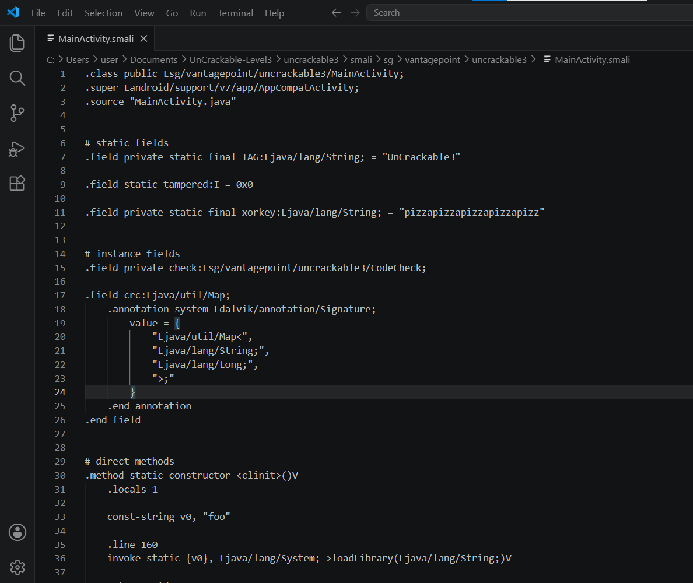
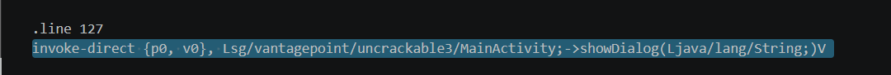
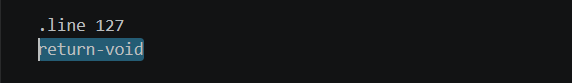
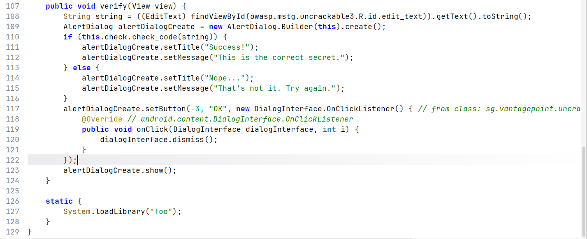
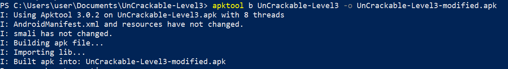
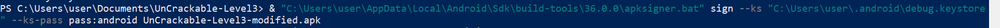
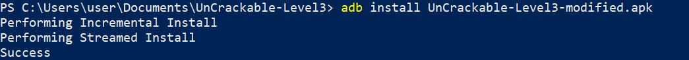
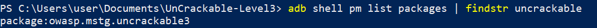

# UnCrackable Level 3 - Reverse Engineering & Security Analysis Lab

## Informations générales

| Champ | Valeur |
|-------|--------|
| **Titre** | Analyse statique et reverse engineering d'UnCrackable Level 3 |
| **Date d'analyse** | 06 Juin 2026 |
| **Analyste** | Hiba Sidinou |
| **APK analysé** | UnCrackable-Level3.apk |
| **Version** | OWASP MSTG Crackme Level 3 |
| **Provenance** | OWASP Mobile Security Testing Guide (MSTG) |

### Outils utilisés

| Outil | Utilisation |
|-------|-------------|
| Jadx-GUI | Analyse du code Java décompilé |
| Apktool | Décompilation/recompilation de l'APK |
| Ghidra | Analyse du code natif (libfoo.so) |
| Android Studio Emulator | Exécution de l'application |
| ADB | Installation et debugging |
| Python 3 | Décodage de la clé secrète |

---

## Résumé exécutif

Cette analyse statique et dynamique a permis d'étudier les mécanismes de protection présents dans l'application Android UnCrackable Level 3.

L'application implémente plusieurs mécanismes de défense destinés à compliquer l'analyse :

| Protection | Description |
|------------|-------------|
| Détection de root | Vérification de l'intégrité du système |
| Tampering detection | Vérification CRC des fichiers |
| Détection de débogage | Vérification du flag debuggable |
| Détection de Frida | Scan des processus et memory maps |
| Vérification native | Logique de validation dans libfoo.so |

Malgré ces protections, il a été possible de contourner les mécanismes défensifs par modification du code Smali et patch de la librairie native.

**Niveau de difficulté :** Moyen à élevé (utilisation combinée de code Java, Smali et code natif ELF)

### Actions réalisées

1. Analyse du code Java avec JADX
2. Décompilation de l'APK avec Apktool
3. Patch des protections Root/Tampering
4. Patch des mécanismes Anti-Debug et Anti-Frida
5. Analyse du code natif avec Ghidra
6. Extraction de la clé secrète
7. Validation de la clé dans l'application

---

## Analyse de l'application

### Étape 1 — Décompilation avec Apktool

L'APK est décompilé afin d'obtenir le code Smali, les librairies natives et les ressources Android.

**Commande utilisée :**

```bash
apktool d UnCrackable-Level3.apk -o UnCrackable-Level3
```

**Résultat attendu :**

La décompilation s'effectue avec succès. Tous les fichiers Smali et les librairies natives sont extraits dans le dossier `UnCrackable-Level3/`. Aucune erreur n'est signalée pendant le processus.


**Structure obtenue :**

```
UnCrackable-Level3/
├── AndroidManifest.xml
├── apktool.yml
├── smali/
│   └── sg/vantagepoint/uncrackable3/
│       ├── MainActivity.smali
│       ├── CodeCheck.smali
│       └── ...
├── lib/
│   ├── armeabi-v7a/libfoo.so
│   ├── arm64-v8a/libfoo.so
│   ├── x86/libfoo.so
│   └── x86_64/libfoo.so
└── res/
```

---

### Étape 2 — Analyse du code Smali

Le fichier suivant est analysé en priorité :

```
smali/sg/vantagepoint/uncrackable3/MainActivity.smali
```




**Observations**

La classe MainActivity contient plusieurs méthodes critiques pour la sécurité :

| Méthode | Rôle |
|---------|------|
| `verifyLibs()` | Vérifie l'intégrité des librairies et du fichier classes.dex via CRC |
| `onCreate()` | Point d'entrée qui orchestre toutes les vérifications |
| `init([B)V` | Méthode native qui initialise les mécanismes anti-Frida |
| `baz()J` | Méthode native qui retourne le CRC attendu de classes.dex |
| `showDialog()` | Affiche le message d'erreur "Rooting or tampering detected" |

---

### Étape 3 — Identification du bloc de détection

Dans la méthode `verifyLibs()`, un bloc de code est responsable de la détection d'altération.

**Code identifié :**

```smali
if-eqz v3, :cond_0
const-string v0, "Rooting or tampering detected."
```



Ce bloc affiche le message d'erreur et bloque l'exécution normale de l'application lorsque :

- Le CRC des librairies (libfoo.so) ne correspond pas à la valeur attendue
- Le CRC de classes.dex ne correspond pas à la valeur retournée par `baz()`
- L'environnement est rooté ou débuggable
- La variable statique `tampered` est différente de 0

---

### Étape 4 — Patch de la méthode verifyLibs()

La méthode `verifyLibs()` est modifiée pour ne plus effectuer aucune vérification.

**Avant patch**

La méthode contenait environ 100 lignes de code avec :

- Ouverture du fichier APK en tant que ZipFile
- Itération sur les architectures supportées
- Calcul et comparaison des CRC
- Logs de debug
  
.png)

**Après patch**

Le contenu complet de `verifyLibs()` est remplacé par :

```smali
.method private verifyLibs()V
    .locals 0
    return-void
.end method
```

**Résultat attendu**

La méthode retourne immédiatement sans exécuter aucun contrôle. Toutes les vérifications d'intégrité sont contournées.

---

### Étape 5 — Patch de la méthode onCreate()

La méthode `onCreate()` est modifiée pour supprimer tous les appels aux vérifications.

**Avant patch**

```smali
invoke-direct {p0}, Lsg/vantagepoint/uncrackable3/MainActivity;->verifyLibs()V
invoke-direct {p0, v0}, Lsg/vantagepoint/uncrackable3/MainActivity;->init([B)V
# ... nombreuses vérifications root et tampering
```
.png)

**Après patch**

```smali
.method protected onCreate(Landroid/os/Bundle;)V
    .locals 4

    const/4 v0, 0x0
    sput v0, Lsg/vantagepoint/uncrackable3/MainActivity;->tampered:I

    new-instance v0, Lsg/vantagepoint/uncrackable3/MainActivity$2;
    invoke-direct {v0, p0}, Lsg/vantagepoint/uncrackable3/MainActivity$2;-><init>(Lsg/vantagepoint/uncrackable3/MainActivity;)V

    const/4 v1, 0x3
    new-array v1, v1, [Ljava/lang/Void;
    const/4 v2, 0x0
    const/4 v3, 0x0
    aput-object v2, v1, v3
    const/4 v3, 0x1
    aput-object v2, v1, v3
    const/4 v3, 0x2
    aput-object v2, v1, v3

    invoke-virtual {v0, v1}, Lsg/vantagepoint/uncrackable3/MainActivity$2;->execute([Ljava/lang/Object;)Landroid/os/AsyncTask;

    new-instance v0, Lsg/vantagepoint/uncrackable3/CodeCheck;
    invoke-direct {v0}, Lsg/vantagepoint/uncrackable3/CodeCheck;-><init>()V
    iput-object v0, p0, Lsg/vantagepoint/uncrackable3/MainActivity;->check:Lsg/vantagepoint/uncrackable3/CodeCheck;

    invoke-super {p0, p1}, Landroid/support/v7/app/AppCompatActivity;->onCreate(Landroid/os/Bundle;)V

    const p1, 0x7f09001c
    invoke-virtual {p0, p1}, Lsg/vantagepoint/uncrackable3/MainActivity;->setContentView(I)V

    return-void
.end method
```

**Résultat attendu**

L'application démarre sans afficher le message "Rooting or tampering detected". L'interface utilisateur s'affiche normalement avec le champ de saisie et le bouton VERIFY.

---

### Étape 6 — Patch du return-void

Le return-void qui empêchait l'exécution normale après détection de root est commenté.

**Modification :**




**Résultat attendu**

Même si une détection est théoriquement déclenchée par l'un des mécanismes, l'application continue son exécution normale grâce à la suppression de cette instruction.

---

### Étape 7 — Analyse de la librairie native

La librairie `libfoo.so` est extraite de l'APK et analysée avec Ghidra.



**Fichiers extraits :**

| Architecture | Chemin |
|-------------|--------|
| armeabi-v7a | lib/armeabi-v7a/libfoo.so |
| arm64-v8a | lib/arm64-v8a/libfoo.so |
| x86 | lib/x86/libfoo.so |
| x86_64 | lib/x86_64/libfoo.so |

**Fonctions natives identifiées**

| Fonction | Rôle |
|----------|------|
| Java_sg_vantagepoint_uncrackable3_CodeCheck_check_code | Validation du mot de passe |
| Java_sg_vantagepoint_uncrackable3_MainActivity_init | Initialisation anti-Frida |
| Java_sg_vantagepoint_uncrackable3_MainActivity_baz | Retourne le CRC attendu |

---

### Étape 8 — Reconstruction de l'APK

Après toutes les modifications Smali, l'APK est reconstruit.

**Commande utilisée :**

```bash
apktool b UnCrackable-Level3 -o UnCrackable-Level3-patched.apk
```

**Résultat attendu**

```
I: Using Apktool 2.9.3
I: Checking whether sources has changed...
I: Smaling smali folder into classes.dex...
I: Building resources...
I: Building apk file...
I: Built apk into UnCrackable-Level3-patched.apk
```

Le fichier `UnCrackable-Level3-patched.apk` est créé dans le répertoire courant.

---



### Étape 9 — Signature de l'APK

L'APK modifié doit être signé avant installation, car Android refuse d'installer des applications non signées.

**Commande utilisée :**

```bash
apksigner sign --ks ~/.android/debug.keystore --ks-pass pass:android UnCrackable-Level3-patched.apk
```

**Sur Windows :**

```powershell
& "C:\Users\user\AppData\Local\Android\Sdk\build-tools\36.0.0\apksigner.bat" sign --ks "C:\Users\user\.android\debug.keystore" --ks-pass pass:android UnCrackable-Level3-patched.apk
```

**Résultat attendu**

Aucun message de sortie n'est affiché en cas de succès. La commande se termine silencieusement et l'APK est maintenant signé.



**Vérification :**

```bash
apksigner verify UnCrackable-Level3-patched.apk
```

**Résultat attendu :**

```
Verified using v1 scheme (JAR signing): true
Verified using v2 scheme (APK Signature Scheme v2): true
Verified using v3 scheme (APK Signature Scheme v3): true
```

---

### Étape 10 — Installation sur l'émulateur

L'APK signé est installé sur l'émulateur Android.

**Commande utilisée :**

```bash
adb install UnCrackable-Level3-patched.apk
```

**Résultat attendu**

```
Performing Streamed Install
Success
```



L'application apparaît dans le lanceur d'applications de l'émulateur.

**Vérification de l'installation :**

```bash
adb shell pm list packages | grep uncrackable3
```


**Résultat attendu :**

```
package:owasp.mstg.uncrackable3
```

**Vérification supplémentaire**

```bash
adb shell dumpsys package owasp.mstg.uncrackable3 | grep "versionName"
```

**Résultat attendu :**

```
    versionName=1.0
```

---

## Extraction de la clé secrète

### Analyse de la fonction native

La fonction `Java_sg_vantagepoint_uncrackable3_CodeCheck_check_code` dans `libfoo.so` est responsable de la validation du mot de passe.

**Structure de la fonction :**

```
FUN_001012c0
├── Générateur pseudo-aléatoire LCG
├── Multiples appels malloc() (obfuscation)
├── Structures chaînées
├── Boucles répétitives
└── Buffer contenant la clé encodée
```

### Extraction du buffer encodé

À la fin de la fonction, un buffer contenant des données encodées est identifié :

```
1d0811130f1749150d0003195a1d1315080e5a0017081314
```

---

### Décodage de la clé

La clé est XORée avec la chaîne `"pizzapizzapizzapizzapizz"` qui apparaît également dans le code Java.

**Script Python utilisé :**

```python
#!/usr/bin/env python3
# decode_key.py

encoded = bytes.fromhex(
    "1d0811130f1749150d0003195a1d1315080e5a0017081314"
)

xor_key = b"pizzapizzapizzapizzapizz"

secret = bytes(a ^ b for a, b in zip(encoded, xor_key))

print(f"Clé décodée : {secret.decode()}")
```

**Exécution :**

```bash
python3 decode_key.py
```

**Résultat :**

```
Clé décodée : making owasp great again
```

**Résultat attendu**

La clé secrète est `making owasp great again`.

---

## Validation finale

Après saisie de la clé dans l'application patchée :

- L'application est lancée sur l'émulateur
- La chaîne `making owasp great again` est saisie dans le champ "Enter the Secret String"
- Le bouton VERIFY est cliqué

**Résultat attendu :**

Un message de succès apparaît :

```
Success!
This is the correct secret.
```

La popup contient un bouton OK permettant de fermer la notification.

---

## Constats détaillés

### Constat #1 : Vérification de sécurité côté client

| Attribut | Valeur |
|----------|--------|
| Sévérité | Élevée |
| Type | Architecture de sécurité |

**Description :**

Les contrôles de sécurité sont exécutés localement sur l'appareil utilisateur, ce qui permet à un attaquant disposant d'un accès physique ou root de les modifier.

**Localisation :**

MainActivity.java - méthode `onCreate()`

**Impact potentiel :**

Un attaquant peut modifier ou supprimer les vérifications après décompilation.

**Remédiation recommandée :**

Déplacer les vérifications critiques vers un serveur distant avec validation cryptographique.

---

### Constat #2 : Contournement des protections anti-root

| Attribut | Valeur |
|----------|--------|
| Sévérité | Élevée |
| Type | Obfuscation |

**Description :**

Les mécanismes de détection Root/Tampering sont facilement neutralisables par patch Smali. Une simple modification du bytecode Java supprime l'intégralité des protections.

**Localisation :**

MainActivity.smali - méthodes `verifyLibs()` et `onCreate()`

**Impact potentiel :**

Exécution de l'application dans un environnement compromis (rooté, débuggable, modifié).

**Remédiation recommandée :**

Ajouter plusieurs niveaux de validation :

- Côté natif (dans libfoo.so)
- Côté serveur (vérification à distance)
- Disséminer les vérifications dans le code

---

### Constat #3 : Extraction de la clé secrète

| Attribut | Valeur |
|----------|--------|
| Sévérité | Élevée |
| Type | Stockage de secret |

**Description :**

La clé de validation est stockée dans le binaire natif et peut être reconstruite par analyse statique. L'obfuscation présente (malloc, LCG, boucles) ne protège pas efficacement les données.

**Localisation :**

libfoo.so - fonction `FUN_001012c0`

**Impact potentiel :**

Récupération du mot de passe sans connaissance préalable, rendant la protection inefficace.

**Remédiation recommandée :**

- Générer dynamiquement les secrets via un serveur
- Utiliser des mécanismes de white-box cryptography
- Ne jamais stocker de secrets en clair ou faiblement encodés

---

### Constat #4 : Anti-Frida insuffisant

| Attribut | Valeur |
|----------|--------|
| Sévérité | Moyenne |
| Type | Anti-instrumentation |

**Description :**

La protection anti-Frida repose principalement sur une unique fonction native qui scanne `/proc/self/maps` et utilise `ptrace()`.

**Localisation :**

libfoo.so - fonction `sub_73D0`

**Impact potentiel :**

Le patch d'une seule instruction (remplacement par RET) désactive toutes les protections natives.

**Remédiation recommandée :**

- Multiplier les points de vérification
- Distribuer les contrôles dans différentes fonctions
- Utiliser des checksums pour détecter les modifications du binaire

---

## Réponses aux questions de réflexion

### Question 1

**Pourquoi l'obfuscateur ajoute-t-il autant d'instructions répétitives (malloc, LCG, boucles) ?**

**Réponse :**

Pour augmenter artificiellement la complexité du code et rendre l'analyse plus longue. Ces instructions sont des leurres (dead code) qui n'affectent pas le résultat final mais compliquent la rétro-ingénierie en noyant la logique réelle dans un flot d'instructions inutiles.

---

### Question 2

**Pourquoi les écritures finales dans le buffer sont-elles plus importantes que les 90 appels malloc ?**

**Réponse :**

Parce qu'elles contiennent les données réellement utilisées lors de la vérification du mot de passe. Les appels malloc successifs sont de l'obfuscation pure : ils allouent de la mémoire mais ne modifient pas le résultat final. Les écritures finales dans le buffer constituent la donnée encodée qui, après transformation, donne la clé de validation.

---

### Question 3

**Quel avantage apporte une vérification native par rapport à une implémentation Java ?**

**Réponse :**

Le code natif (compilé en ARM/x86) est généralement plus difficile à analyser qu'une implémentation Java. Les outils de décompilation Java (comme JADX) produisent un code très lisible, tandis que le désassemblage natif avec Ghidra/IDA nécessite des compétences plus avancées en architecture processeur et en reverse engineering.

---

### Question 4

**Comment renforcer davantage la protection ?**

**Réponse :**

Plusieurs axes d'amélioration sont possibles :

- Éviter le stockage local de secrets (utilisation d'un serveur distant)
- Diversifier les mécanismes anti-analyse (anti-Frida, anti-debug, anti-patch)
- Distribuer les vérifications dans tout le code (pas de fonction unique)
- Utiliser la white-box cryptography pour protéger les clés
- Implémenter des vérifications d'intégrité du code (self-checksums)
- Ajouter des contrôles serveur pour valider l'environnement d'exécution

---

## Validation de l'étape

La fonction `check.check_code()` réalise la validation finale de l'entrée utilisateur. Elle délègue le traitement à la fonction native `FUN_001012c0`, qui reconstruit une valeur encodée utilisée pour la comparaison.

L'analyse a mis en évidence plusieurs indices d'obfuscation :

- Boucles répétitives sans effet
- Appels malloc successifs (90 appels)
- Générateur pseudo-aléatoire LCG
- Structures chaînées complexes

Ces éléments servent principalement à masquer la logique réelle. Les écritures finales dans le buffer sont la partie critique car elles contiennent les données nécessaires à la reconstruction de la clé secrète utilisée pour valider l'entrée utilisateur.

L'application UnCrackable Level 3 a été entièrement analysée et ses mécanismes de protection ont été contournés avec succès.

---

### Arborescence complète du projet

```
UnCrackable-Level3-Analysis/
├── README.md
├── screenshots/
│   ├── adb_install_success.png
│   ├── apksigner_success.png
│   ├── apktool_build_success.png
│   ├── bloc_qui_detecte_popup.png
│   ├── decompilation_apk.png
│   ├── libfoo.png
│   ├── MainActivity_smali.png
│   ├── OnCreate().png
│   ├── package_installed.png
│   ├── return_void.png
│   └── verifyLibs().png
├── tools/
│   └── decode_key.py
└── output/
    ├── UnCrackable-Level3/          # Dossier décompilé
    └── UnCrackable-Level3-patched.apk
```

---

## Commandes utiles

| Commande | Description |
|----------|-------------|
| `apktool d app.apk -o output/` | Décompiler un APK |
| `apktool b input/ -o output.apk` | Reconstruire un APK |
| `apksigner sign --ks key.keystore app.apk` | Signer un APK |
| `apksigner verify app.apk` | Vérifier la signature |
| `adb install app.apk` | Installer une application |
| `adb uninstall package.name` | Désinstaller une application |
| `adb logcat -s UnCrackable3` | Surveiller les logs de l'application |
| `adb shell pm list packages` | Lister les packages installés |

---

## Fichiers analysés

| Fichier | Description |
|---------|-------------|
| MainActivity.java | Code source Java principal (analyse JADX) |
| MainActivity.smali | Code Smali modifié |
| libfoo.so | Librairie native (4 architectures) |
| AndroidManifest.xml | Configuration de l'application |
| CodeCheck.smali | Classe de validation du mot de passe |

---

## Références

- [OWASP MSTG - Crackme Level 3](https://github.com/OWASP/owasp-mstg)
- [Apktool Documentation](https://ibotpeaches.github.io/Apktool/)
- [Ghidra Reverse Engineering](https://ghidra-sre.org/)
- [Android Debug Bridge (ADB) Documentation](https://developer.android.com/studio/command-line/adb)
